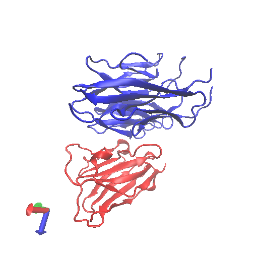

```{r}
library(bio3d)


aln <- read.fasta("MSA.clustal_num.fst")
aln
```

```{r}
hi <- get.pdb("MSA.clustal_num.fst")

hi
```


```{r}
#install.packages("pheatmap")
library(pheatmap)

ide <- seqidentity(aln)

pheatmap((1-ide))


```


```{r}
#pdb <- read.pdb("6u2f.pdb")

hits <- NULL
hits$pdb.id <- c('6U2F','2QTW','2XTJ')

files <- get.pdb(hits$pdb.id, path="pdbs", split=TRUE, gzip=TRUE)

pdbs <- pdbaln(files, fit = TRUE)
```


```{r}
#ids <- basename.pdb(pdbs$id)
#plot(pdbs, labels=ids)

#install.packages("bio3d.view")

blast1 <- blast.pdb(pdbs)

blast1


```

```{r}
ann <- pdb.annotate('5WSL')

View(ann)

```




