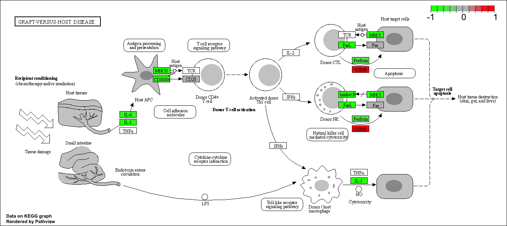
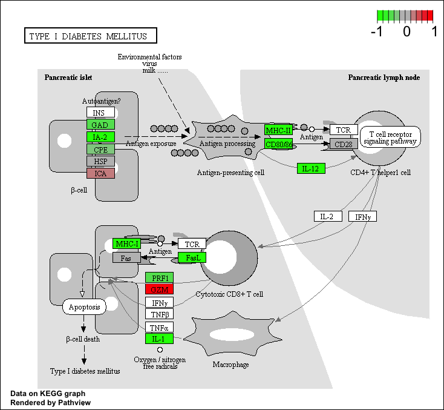

##Background
Our data for today came from Himes et. al. RNASeq analysis of the drug dexamethasone, a synthetic glucocorticoid steroid with anti-inflammatory effects (Himes et al. 2014).


Import and Read countData and colData
```{r}
counts <- read.csv("airway_scaledcounts.csv", row.names=1)
metadata <-  read.csv("airway_metadata.csv")
```

Let's look at our data!
```{r}
head(counts)
head(metadata)
```

>Q1. How many genes are in this dataset?

38694

>Q2. How many ‘control’ cell lines do we have?

4

```{r}
dim(counts)
dim(metadata)

#more robust method
sum(metadata$dex == "control")
```
First  I need to extract all the "control" columns. Then I will take the rowwise mean to get the average count calues for all genes in these four experiements. 
```{r}
control.inds <- metadata$dex == "control"
control.counts1 <- counts[ , control.inds]
head(control.counts1)
```

Store control means.
```{r}
control.mean1 <- rowMeans(control.counts1)
```

Now let's do the same thing for the treated samples. 
```{r}
treated.inds <- metadata$dex == "treated"
treated.counts1 <- counts[ , treated.inds]
head(treated.counts1)
```

Store treated means. 
```{r}
treated.mean1 <- rowMeans(treated.counts1)
```

Put the two mean data sets into the same dataframe for further analysis/dipslay. 

```{r}
meancounts1 <- data.frame(control.mean1, treated.mean1)
colSums(meancounts1)
#correct!
```


This bit of code will first find the sample id for those labeled control. Then, it will calculate the mean counts per gene across these samples.
(This is code based on the Handout, in order to answer the followng questions. The above chunks are what was done in lab, and I kept both for personal understanding. Thank you.)

```{r}
control <- metadata[metadata[,"dex"]=="control",]
control.counts <- counts[ ,control$id]
control.mean <- rowSums( control.counts )/4 
head(control.mean)
```

An alternative method using the dyplr package from tidyverse: 
```{r}
#library(dplyr)
#control <- metadata %>% filter(dex=="control")
#control.counts <- counts %>% select(control$id) 
#control.mean <- rowSums(control.counts)/4
#head(control.mean)
```

>Q3. How would you make the above code in either approach more robust? (ie what would happen if we have more than 4 rows?)

```{r}
#I can sub the hard coded denominator of "4" for nrow(control), so that this code chunk will now be able to adjust it's calculations given any added/extra data in the future. 

control <- metadata[metadata[,"dex"]=="control",]
control.counts <- counts[ ,control$id]
control.mean <- rowSums( control.counts )/nrow(control)
head(control.mean)
```

>Q4. Follow the same procedure for the treated samples (i.e. calculate the mean per gene across drug treated samples and assign to a labeled vector called treated.mean)

```{r}
treated <- metadata[metadata[,"dex"]=="treated",]
treated.mean <- rowSums( counts[ ,treated$id] )/4 
names(treated.mean) <- counts$ensgene
```

Combine the meancount data for possible use later on. 
```{r}
meancounts <- data.frame(control.mean, treated.mean)
colSums(meancounts)
```

>Q5 (a). Create a scatter plot showing the mean of the treated samples against the mean of the control samples.

```{r}
plot(meancounts[,1],meancounts[,2], xlab="Control", ylab="Treated")
#points along the diagonal would suggest that the drug compared to control had very little difference in results. (no/little drug effect observed)
```

>Q5 (b).You could also use the ggplot2 package to make this figure producing the plot below. What geom_?() function would you use for this plot?

geom_point()


>Q6. Try plotting both axes on a log scale. What is the argument to plot() that allows you to do this?

log = "xy"

```{r}
plot(meancounts, log="xy", xlab="Control", ylab="Treated")
```
We often use log2 in thsi field because it has nice math properties that make interpretation easier. 
For log2, we see 0 values for no change, + calues for increases, and - values for decreases. This nivce property lead us to work with **log2(fold-change)** all the time in the genomics and proteomics field. 

Let's add the **log2(fold-change)** to the 'meancounts' data frame. 

```{r}
meancounts$log2fc <- log2(meancounts[,"treated.mean"]/meancounts[,"control.mean"])
head(meancounts)

```

There are a couple of “weird” results. Namely, the NaN (“not a number”) and -Inf (negative infinity) results.
Let's get rid of these zero count results. I can use the **which()** function with the 'arr.ind=TRUE' argument to get the columns and rows where the TRUE values are. (ie the zero counts in our case).
```{r}
zero.vals <- which(meancounts[,1:2]==0, arr.ind=TRUE)

to.rm <- unique(zero.vals[,"row"])
#sort(to.rm)

#Now remove these from our meancounts dataframe.
mycounts <- meancounts[-to.rm,]
head(mycounts)

nrow(mycounts)
#there are now 21817 genes left after we omitted the zero count results. 
```

>Q7. What is the purpose of the arr.ind argument in the which() function call above? Why would we then take the first column of the output and need to call the unique() function?

The arr.ind argument in the which() function, is a logical that when TRUE will lead the which() function to return the row and column (position) of the data point for which it is TRUE. For our purposes, this return/true value will tell us when the genes/rows and samples/columns have zero counts, so that we can ignore the zero counts in any sample/column and just use the genes/row answers. 
Calling the unique() function will make sure that we do not count any row twice if it has zero entries in both samples. 


Now, let’s filter the dataset both ways to see how many genes are up or down-regulated.
```{r}
up.ind <- mycounts$log2fc > 2
down.ind <- mycounts$log2fc < (-2)

table(up.ind)
table(down.ind)
```
>Q8. Using the up.ind vector above can you determine how many up regulated genes we have at the greater than 2 fc level?

250 upregulated genes are greater than 2 fc level.

>Q9. Using the down.ind vector above can you determine how many down regulated genes we have at the greater than 2 fc level? 

367 downregulated genes are greater than 2 fc level. 

>Q10. Do you trust these results? Why or why not?

Not quite yet, since all we have done so far is configured the data's fold changes; however, we have yet to understand if these fold changes are statistically significant differences between the experimental and control groups. 

##DESeq2 Analysis

Call the previously installed DESeq2 BiocManager package to our Studio. 
```{r}
library(DESeq2)
```

```{r}
dds <- DESeqDataSetFromMatrix(countData=counts, 
                              colData=metadata, 
                              design=~dex)
dds
```
##DESeq analysis
Here, we will run the DESeq pipeline on the dds object, and reassign the whole thing back to dds, which will now be a DESeqDataSet populated with all those values. The **DESeq()** function calls a number of other functions within the package to essentially run the entire pipeline (normalizing by library size by estimating the “size factors,” estimating dispersion for the negative binomial model, and fitting models and getting statistics for each gene for the design specified when you imported the data).
```{r}
dds <- DESeq(dds)
```
Now, we can simply get the results using the **results()** function. Note, our experiment for today is relatively simple: 2 gropus, single factored, treated vs. untreated. 

```{r}
res <- as.data.frame(results(dds))
head(res)
```
Summarize some basic tallies using the summary function.

```{r}
summary(res)
```

 By default the argument alpha is set to 0.1. If the adjusted p value cutoff will be a value other than 0.1, we can set the alpha value. 
 Let's create a variable that elminates all data with p-value over threshold 0.05. 
```{r}
res05 <- results(dds, alpha=0.05)
summary(res05)
```
 
##Adding annotation data

We will use one of Bioconductor’s main annotation packages to help with mapping between various ID schemes. Here we load the AnnotationDbi package and the annotation data package for humans org.Hs.eg.db.

For this we need 2 Bioconductor packages: AnnotationDbi and org.Hs.eg.db

```{r}
library("AnnotationDbi")
library("org.Hs.eg.db")
```
The later of these is is the organism annotation package (“org”) for Homo sapiens (“Hs”), organized as an AnnotationDbi database package (“db”), using Entrez Gene IDs (“eg”) as primary key. To get a list of all available key types that we can use to map between, use the columns() function:

```{r}
columns(org.Hs.eg.db)
```

We will use the 'mapIDs' function to translate between identifiers from different databases. 

>Q11. Run the mapIds() function two more times to add the Entrez ID and UniProt accession and GENENAME as new columns called res$entrez, res$uniprot and res$genename.

```{r}
res$symbol <- mapIds(org.Hs.eg.db,
                     keys=row.names(res), # Our genenames
                     keytype="ENSEMBL",        # The format of our genenames
                     column="SYMBOL",          # The new format we want to add
                     multiVals="first")

res$entrez <- mapIds(org.Hs.eg.db,
                     keys=row.names(res),
                     column="ENTREZID",
                     keytype="ENSEMBL",
                     multiVals="first")

res$uniprot <- mapIds(org.Hs.eg.db,
                     keys=row.names(res),
                     column="UNIPROT",
                     keytype="ENSEMBL",
                     multiVals="first")

res$genename <- mapIds(org.Hs.eg.db,
                     keys=row.names(res),
                     column="GENENAME",
                     keytype="ENSEMBL",
                     multiVals="first")


head(res)
```

##Data Visualization

Let's make a commmonly produced visualization from this data, namely a so-called Volcano plot. These summary figures are frequently used to highlight the proportion of genes that are both significantly regulated and display a high fold change.

Typically these plots shows the log fold change on the X-axis, and the −log10 of the p-value on the Y-axis (the more significant the p-value, the larger the −log10 of that value will be). A very dull (i.e. non colored and labeled) version can be created with a quick call to plot() like so:

```{r}
plot(res$log2FoldChange, log(res$padj))
```


This is not a useful plot becuase all the small p-values are hidden at the bottom of the plot and we can't really see them. -Log will help.

```{r}
plot( res$log2FoldChange,  -log(res$padj), 
      xlab="Log2(FoldChange)",
      ylab="-Log(P-value)")
```

To make this more useful we can add some guidelines (with the abline() function) and color (with a custom color vector) highlighting genes that have padj<0.05 and the absolute log2FoldChange>2.

```{r}
plot( res$log2FoldChange,  -log(res$padj), 
 ylab="-Log(P-value)", xlab="Log2(FoldChange)")

# Add some cut-off lines
abline(v=c(-2,2), col="darkgray", lty=2)
abline(h=-log(0.05), col="darkgray", lty=2)
```

Finally, let's add some color to the points by setting up a custom color vector indicating transcripts with large fold change and significant differences between conditions (ie. the genes/points we care about - that is those with large fold-change and low p-values (ie high -log(p-values))).

```{r}
# Setup my custom point color vector. 
mycols <- rep("gray", nrow(res))
mycols[ abs(res$log2FoldChange) > 2 ]  <- "red" 

inds <- (res$padj < 0.01) & (abs(res$log2FoldChange) > 2 )
mycols[ inds ] <- "blue"

# Volcano plot with custom colors 
plot( res$log2FoldChange,  -log(res$padj), 
 col=mycols, ylab="-Log(P-value)", xlab="Log2(FoldChange)" )

# Cut-off lines
abline(v=c(-2,2), col="gray", lty=2)
abline(h=-log(0.1), col="gray", lty=2)
```

##Save Our Results

Write out whole data set, including genes that did not change significantly. 
```{r}
write.csv(res, file="allmyresults.csv")
```


Let's make an Enhanced Volcano Plot! (adding gene labels and more differentiating color)

```{r}
#Load EnhancedVolcano package from BiocManager
library(EnhancedVolcano)
```

Make Plot

```{r}
x <- as.data.frame(res)

EnhancedVolcano(x,
    lab = x$symbol,
    x = 'log2FoldChange',
    y = 'pvalue')
```

##Pathway Analysis/Gene Set Annotation

```{r}
#load the pakages we need from GAGE
library(pathview)
library(gage)
library(gageData)
```


```{r}
#Load the KEGG data-sets I need
data(kegg.sets.hs)

# Examine the first 2 pathways in this kegg set for humans
head(kegg.sets.hs, 2)

```

```{r}
#This is the data storage from when we used the mapIDs() function above to obtain Entrez gene IDs (stored in res$entrez) and we have the fold change results from DESeq2 analysis (stored in res$log2FoldChange).

#res$entrez
foldchanges = res$log2FoldChange
names(foldchanges) = res$entrez
head(foldchanges)
```

Now, let’s run the gage pathway analysis. The main **gage()** function requires a named vector of fold changes, where the names of the values are the Entrez gene IDs.

```{r}
# Get our results
keggres = gage(foldchanges, gsets=kegg.sets.hs, same.dir=TRUE)
```

```{r}
#Now, let's look at the object returned by the gage() function
#This separates out results by "greater" and "less" i.e. those that are up regulated and those that are down regulated. 
attributes(keggres)

#Let's look at the first three down (less) pathways
head(keggres$less, 3)
```

Now, let’s try out the pathview() function from the pathview package to make a pathway plot with our RNA-Seq expression results shown in color.
First, we will try mannually entering the pathway.id (the third one from above as "hsa05310 Asthma"). 

```{r}
pathview(gene.data=foldchanges, pathway.id="hsa05310")
```
Insert pathway generated.


>Q12. Can you do the same procedure as above to plot the pathview figures for the top 2 down-reguled pathways?

```{r}
#top down-regulated pathway
pathview(gene.data=foldchanges, pathway.id="hsa05332")

#second highest down-regulated pathway
pathview(gene.data=foldchanges, pathway.id="hsa04940")
```
Insert pathways generated.






