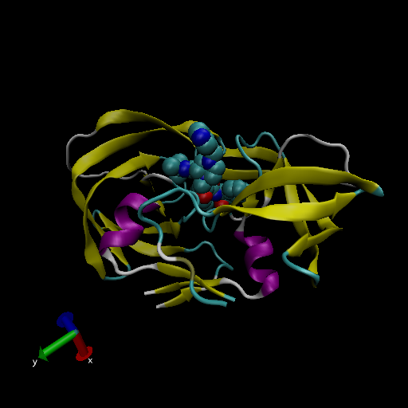

```{r}

db <- read.csv("Data Export Summary.csv", row.names = 1)
head(db)

```

> Q1: What percentage of structures in the PDB are solved by X-Ray and Electron Microscopy.

87.6% structures in PDB solved by X-ray and 4.92% by EM.

```{r}
method.sums <- colSums(db)
method.sums

XRay <- sum(db$X.ray)
EM <- sum(db$EM)
total <- sum(db$Total)

(XRay/total) *100
(EM/total) *100
```

> Q2: What proportion of structures in the PDB are protein?

87.4% are protein only structures in the PDB.

```{r}
type.sums <- rowSums(db)
type.sums
total1 <- sum(type.sums)
(type.sums["Protein (only)"]/total1)*100
```

> Q3: Type HIV in the PDB website search box on the home page and determine how many HIV-1 protease structures are in the current PDB?

There are currently 1828 HIV-1 protease structures in the current PDB.

> Q4: Water molecules normally have 3 atoms. Why do we see just one atom per water molecule in this structure?

The hydrogen atoms per water molecule (2) are not shown because they are very small atoms compared to the oxygen (the one acutally shown) of the water molecules and the other atoms of the structure.

> Q5: There is a conserved water molecule in the binding site. Can you identify this water molecule? What residue number does this water molecule have (see note below)?

residue number MK1902:O4

## VMD structure visualization image



Just write text but you have some **formatting** options. 

I need to load library
```{r}
library(bio3d)

pdb <- read.pdb("1hsg")
pdb
```


Plot B Factor

```{r}
plot.bio3d(pdb$atom$b, sse = pdb)
```


The ATOM records

```{r}
head(pdb$atom)
```


