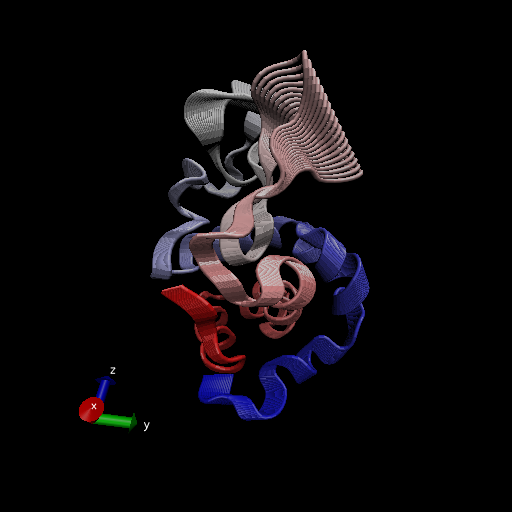
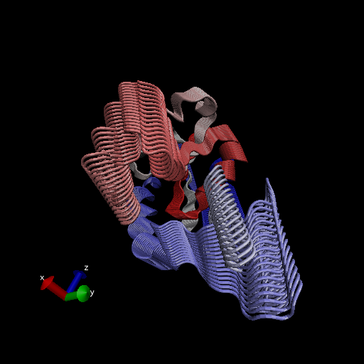
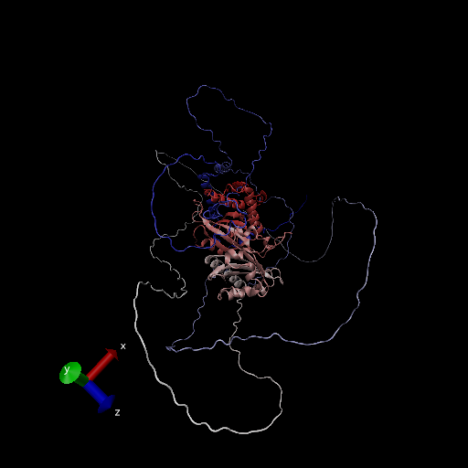

# Comparative Analysis of Protein Structures


Using the bio3d package.

```{r}
library(bio3d)

pdb <- read.pdb("1hel")
pdb

```


Let's use a bioinformatics method caled NMA (Normal Modae Analysis) to predict the dynamics (flexibility) of this enzyme.

```{r}
modes <- nma(pdb)
plot(modes)

```

Make a "movie" of its predicted motion. We often call this a "trajectory." 

```{r}
mktrj(modes, file="nma.pdb")
```




# Analysis of ADK

```{r}
aa <- get.seq("1ake_A")
aa
```

How to Run BLAST from R
```{r}
#blast <- blast.pdb(aa)
#hits <- plot(blast)
#hits$pdb.id

#Let's just use these pre-set hits for now.

hits <- NULL
hits$pdb.id <- c('1AKE_A','4X8M_A','6S36_A','6RZE_A','4X8H_A','3HPR_A','1E4V_A','5EJE_A','1E4Y_A','3X2S_A','6HAP_A','6HAM_A','4K46_A','4NP6_A','3GMT_A','4PZL_A')

```


```{r}
# Download related PDB files
#files <- get.pdb(hits$pdb.id, path="pdbs", split=TRUE, gzip=TRUE)
#save(files, file="myfiles.RData")
load("myfiles.RData")
```

Multiple structure alignment
```{r}
pdbs <- pdbaln(files, fit=TRUE)
```

# PCA
We will use the bio3d pca() function which is designed for proein structure data.
```{r}
# Perform PCA
pc.xray <- pca(pdbs)
plot(pc.xray)
```

Make a trajectory visualization of the motion captured by the first Principal Component. 
```{r}
# Visualize first principal component
pc1 <- mktrj(pc.xray, pc=1, file="pc_1.pdb")
```






>Q7: How many amino acid residues are there in this pdb object? 

198

>Q8: Name one of the two non-protein residues? 

HOH, MK1

>Q9: How many protein chains are in this structure?

2

>Q10. Which of the packages above is found only on BioConductor and not CRAN? 

msa

>Q11. Which of the above packages is not found on BioConductor or CRAN?: 

Grantlab/bio3d-view

>Q12. True or False? Functions from the devtools package can be used to install packages from GitHub and BitBucket? 

TRUE

>Q13. How many amino acids are in this sequence, i.e. how long is this sequence?

214

>Q14. What do you note about this plot? Are the black and colored lines similar or different? Where do you think they differ most and why?

The black and colored lines are similar in pattern, but the black are smaller in amplitude (for the most part). The differ most surrounding the 50th and 125-150ish range, most likely to indicate two major and distinct conformational states of Adk. They differ because the values indicate different flexibilites between the two conformations and their respective bonds in use. 


