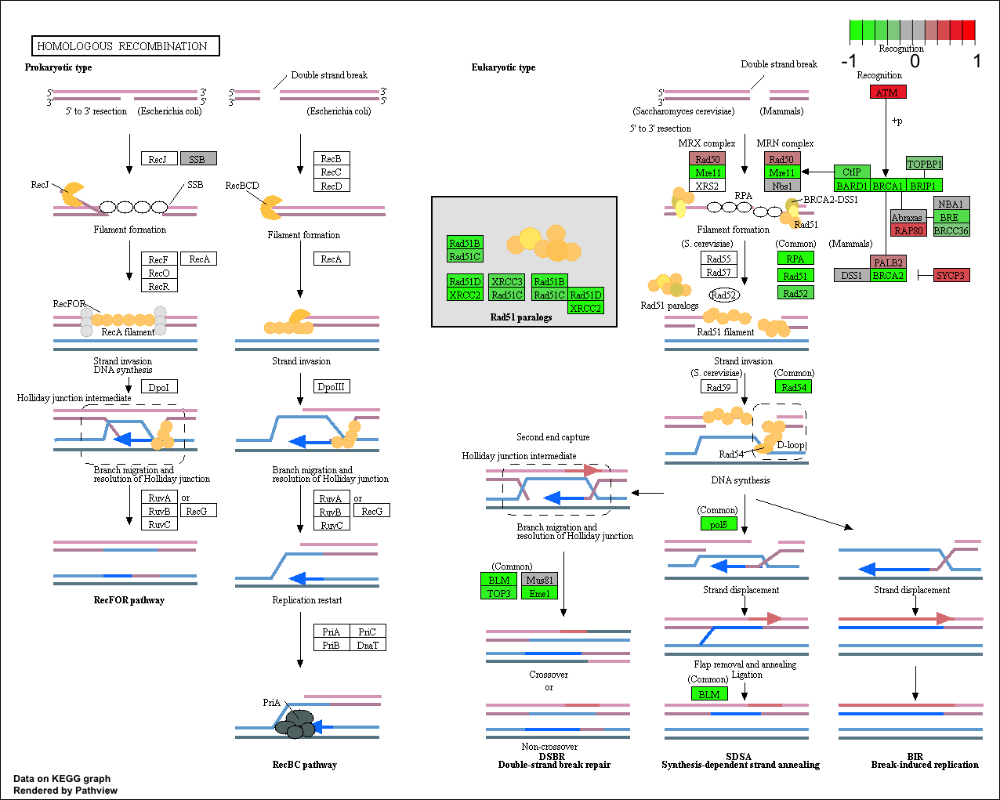

##Differential Expression Analysis

Now let's load our data files.

```{r}
#add variables for later use (if needed)
metaFile <- "GSE37704_metadata.csv"
countFile <- "GSE37704_featurecounts.csv"
```

```{r}
# Import metadata and take a peak
colData = read.csv("GSE37704_metadata.csv", row.names=1)
head(colData)
```

```{r}
# Import countdata
countData = read.csv("GSE37704_featurecounts.csv", row.names=1)
head(countData)
```


```{r}
# Note we need to remove the odd first $length col
countData <- countData[,-1]
head(countData)
```

```{r}
# Filter count data where you have 0 read count across all samples.
countData = countData[rowSums(countData) > 1, ]

head(countData)
```


## DESeq Analysis

```{r}
#load DESeq2
library(DESeq2)
```


```{r}
dds = DESeqDataSetFromMatrix(countData=countData,
                             colData=colData,
                             design=~condition)
dds = DESeq(dds)
```

Get our results

```{r}
res <- results(dds)
head(res)

#Alternative results method
#res = results(dds, contrast=c("condition", "hoxa1_kd", "control_sirna"))
```


```{r}
summary(res)
```


## Volcano Plot

```{r}
plot(res$log2FoldChange, -log(res$padj))
```

Let's improve our plot
```{r}
# Make a color vector for all genes
mycols <- rep("gray", nrow(res) )

# Color red the genes with absolute fold change above 2
mycols[ abs(res$log2FoldChange) > 2 ] <- "red"

# Color blue those with adjusted p-value less than 0.01
# and absolute fold change more than 2
inds <- (res$padj < 0.01) & (abs(res$log2FoldChange) > 2 )
mycols[ inds ] <- "blue"

plot( res$log2FoldChange, -log(res$padj), col= mycols, xlab="Log2(FoldChange)", ylab="-Log(P-value)" )
```

## Adding Gene Annotation

Here we use the AnnotationDbi package to add gene symbols and entrez ids to our results.

```{r}
library(AnnotationDbi)
library(org.Hs.eg.db)
```

```{r}
#to get id types in the org.Hs.eg.db data set
columns(org.Hs.eg.db)
```

Let's use the mapIDs() function multiple times to add SYMBOL, ENTREZID and GENENAME annotation to our results by completing the code below.

```{r}
library("AnnotationDbi")
library("org.Hs.eg.db")

columns(org.Hs.eg.db)

res$symbol = mapIds(org.Hs.eg.db,
                    keys=row.names(res), 
                    keytype="ENSEMBL",
                    column="SYMBOL",
                    multiVals="first")

res$entrez = mapIds(org.Hs.eg.db,
                    keys=row.names(res),
                    keytype="ENSEMBL",
                    column="ENTREZID",
                    multiVals="first")

res$name =   mapIds(org.Hs.eg.db,
                    keys=row.names(res),
                    keytype="ENSEMBL",
                    column="GENENAME",
                    multiVals="first")

head(res, 10)
```


Saving our Results

```{r}
res = res[order(res$pvalue),]
write.csv(res, file ="deseq_results.csv")
```


##Pathway Analysis

First, we need to load our pathway, gage, and gageData packages and set up the KEGG data sets. 

```{r}
library(pathview)
library(gage)
library(gageData)
```

```{r}
#Load data
data(kegg.sets.hs)
data(sigmet.idx.hs)

# Focus on signaling and metabolic pathways only
kegg.sets.hs = kegg.sets.hs[sigmet.idx.hs]

# Examine the first 3 pathways
head(kegg.sets.hs, 3)
```

The main gage() function requires a named vector of fold changes, where the names of the values are the Entrez gene IDs.

Note that we used the mapIDs() function above to obtain Entrez gene IDs (stored in res$entrez) and we have the fold change results from DESeq2 analysis (stored in res$log2FoldChange).

```{r}
foldchanges = res$log2FoldChange
names(foldchanges) = res$entrez
head(foldchanges)
```

Now, let’s run the gage pathway analysis.

```{r}
# Get the results
keggres = gage(foldchanges, gsets=kegg.sets.hs)

#View the attributes of the object returned by gage. 
attributes(keggres)
```

Let's look at the first few down (less) pathway results
```{r}
# Look at the first few down (less) pathways
head(keggres$less)
```

Note, each keggres$less and keggres$greater object is data matrix with gene sets as rows sorted by p-value.


Now, let's try out the pathview() function from the pathview package to make a pathway plot with our RNA-Seq expression results shown in color.
```{r}
pathview(gene.data=foldchanges, pathway.id="hsa04110")
```

Let's insert our newly generated pathway analysis results!


Let's do the same for the top 5 upregulated pathways using a more automatic method. 
```{r}
#Focus on top 5 upregulated pathways here for demo purposes only
keggrespathways <- rownames(keggres$greater)[1:5]

# Extract the 8 character long IDs part of each string
keggresids = substr(keggrespathways, start=1, stop=8)
keggresids
```
Finally, lets pass these IDs in keggresids to the pathview() function to draw plots for all the top 5 pathways.


```{r}
pathview(gene.data=foldchanges, pathway.id=keggresids, species="hsa")
```


Let's do the same procedure as above to plot the pathview figures for the top 5 down-reguled pathways?

```{r}
#Focus on top 5 upregulated pathways here for demo purposes only
keggrespathways2 <- rownames(keggres$less)[1:5]

# Extract the 8 character long IDs part of each string
keggresids1 = substr(keggrespathways2, start=1, stop=8)
keggresids1
```

Generate the 5 pathways from above ids.
```{r}
pathview(gene.data=foldchanges, pathway.id=keggresids1, species="hsa")
```

Insert the above generated pathways for the down regulated group. 




##Gene Ontology

We can also do a similar procedure with gene ontology. Similar to above, go.sets.hs has all GO terms. go.subs.hs is a named list containing indexes for the BP, CC, and MF ontologies. Let’s focus on BP (a.k.a Biological Process) here.

```{r}
data(go.sets.hs)
data(go.subs.hs)

# Focus on Biological Process subset of GO
gobpsets = go.sets.hs[go.subs.hs$BP]

gobpres = gage(foldchanges, gsets=gobpsets, same.dir=TRUE)

lapply(gobpres, head)
```

##Reactome Analysis
Reactome is database consisting of biological molecules and their relation to pathways and processes.

```{r}
sig_genes <- res[res$padj <= 0.05 & !is.na(res$padj), "symbol"]
print(paste("Total number of significant genes:", length(sig_genes)))
```

```{r}
write.table(sig_genes, file="significant_genes.txt", row.names=FALSE, col.names=FALSE, quote=FALSE)
```

Online Analyisis: https://reactome.org/PathwayBrowser/#TOOL=AT

> What pathway has the most significant “Entities p-value”? Do the most significant pathways listed match your previous KEGG results? What factors could cause differences between the two methods?

Endosomal/Vacuolar pathway. No they do not match entirely. Some factors that may have differentiated our results is possibly how we set our p-value limit, how we initially cut down our data/exclusion criteria, and the differences in updated information between the online source and our manually uploaded data (not intersecting with multiple updating data sets as in the case of the online resource).


For good practice:
```{r}
#sessionInfo()
```


